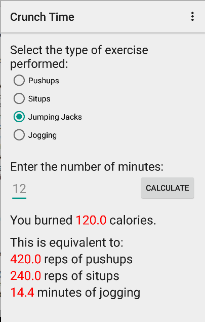
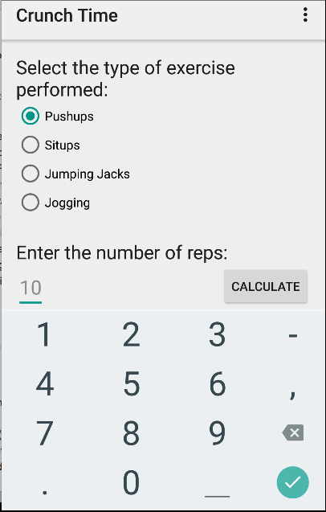
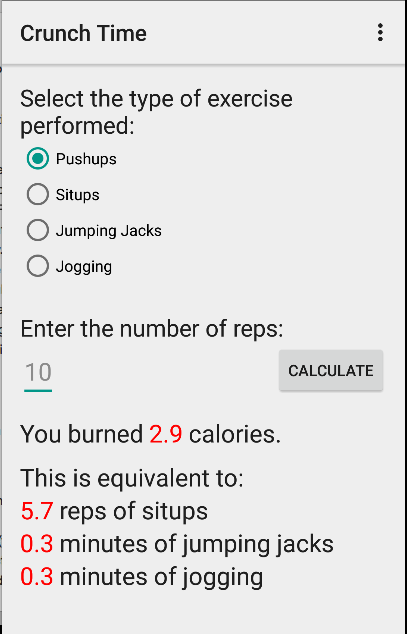
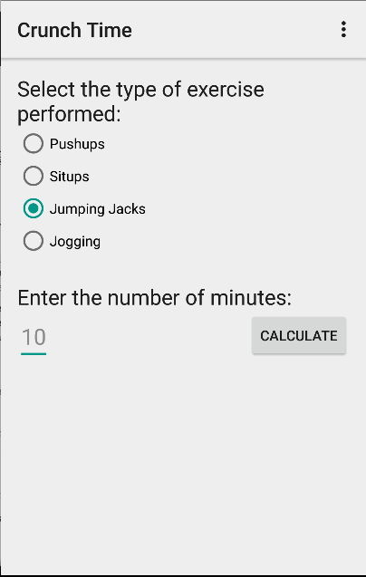

# PROG 01: Crunch Time

Crunch Time is a mobile Anroid app that allows user to calculate the number of calories a 150-lb person would burn from various exercises.  Enter the type of exercise and time/number of reps to figure out how many calories you would burn. You can also view the amount of time or number of reps you would need to perform with different exercises to burn the same number of calories.

## Authors

Zachary Green ([zach.green@berkeley.edu](mailto:zach.green@berkeley.edu))

## Demo Video

See [your demo video title here] (https://link_to_your_video)

## Screenshots

<!--  -->

## Acknowledgments
